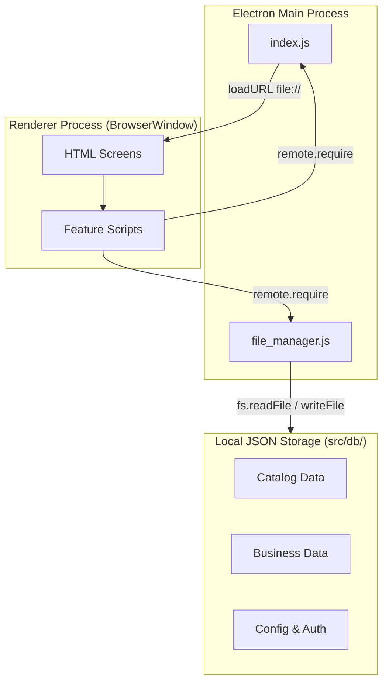
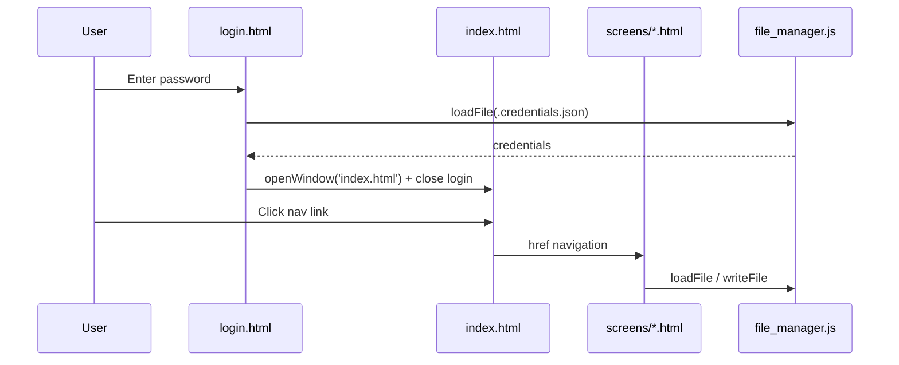
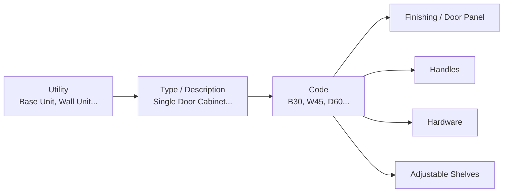
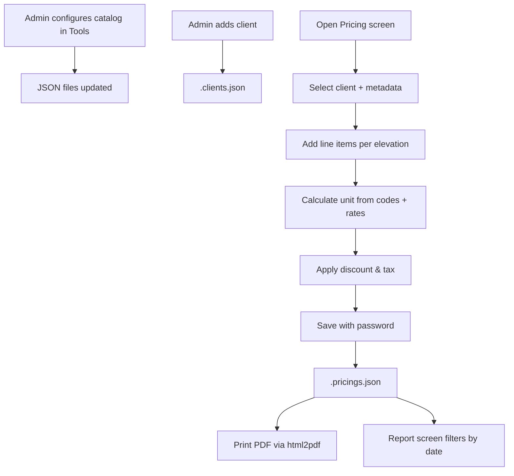

# Cabinet Costing — Architecture & Walkthrough

## Overview

**Cabinet Costing** (`cabinet_costing`) is a desktop application for kitchen/cabinet manufacturers to manage clients, build quotations and invoices, and maintain a catalog of cabinet components with configurable pricing. It is built as an **Electron** app with a **static HTML + jQuery** frontend and **file-based JSON storage** — there is no backend server or database.

| Attribute | Value |
|-----------|-------|
| Package name | `cabinet_costing` |
| Author | Faizan Ali |
| Entry point | `index.js` |
| UI framework | Bootstrap 4 + jQuery |
| Persistence | JSON files in `src/db/` |
| Platform | Cross-platform desktop (Electron 4) |

---

## High-Level Architecture



### Architectural style

- **Single-process Electron shell** with multiple `BrowserWindow` instances (login opens dashboard in a new window).
- **Page-per-feature**: each screen is a standalone HTML file with its own script.
- **Shared data layer**: `file_manager.js` exposes async `loadFile` / `writeFile` used everywhere via Electron's deprecated `remote` module.
- **No routing framework**: navigation is plain `<a href>` links and `main.openWindow()`.

---

## Tech Stack

| Layer | Technology |
|-------|------------|
| Runtime | Node.js + Electron ^4.2.12 |
| UI | HTML5, Bootstrap 4.3, jQuery 3.4 |
| Icons | Font Awesome, Material Design Iconic Font |
| Dates | Moment.js + bootstrap-datetimepicker |
| PDF export | html2pdf.js, jsPDF |
| Packaging | electron-packager (dev) |
| Theme | "AU Admin Template" (Hau Nguyen) — `src/css/theme.css` |

---

## Project Structure

```
app/
├── index.js                 # Electron main process entry
├── package.json
├── src/
│   ├── index.html           # Dashboard / main navigation hub
│   ├── screens/             # All application pages
│   │   ├── login.html
│   │   ├── pricing.html
│   │   ├── new_clients.html
│   │   ├── registration.html
│   │   ├── tools/           # Catalog management screens
│   │   └── settings/        # Admin & reporting screens
│   ├── scripts/             # Page logic (1:1 with screens)
│   ├── db/                  # JSON data store
│   ├── css/                 # App styles
│   ├── js/                  # Shared UI helpers (main.js, datetimepicker)
│   ├── images/              # Logos, avatars
│   └── vendor/              # Third-party JS/CSS (bundled locally)
└── node_modules/
```

---

## Application Entry & Window Lifecycle

### Main process (`index.js`)

On app ready, Electron:

1. Creates a maximized `BrowserWindow` (menu bar hidden).
2. Loads `src/screens/login.html`.
3. Exports `openWindow(file)` for renderer scripts to open new windows.

```javascript
app.on("ready", () => {
  let win = new BrowserWindow({
    zoomToPageWidth: true,
    show: false,
    autoHideMenuBar: true,
  });
  win.maximize();
  win.show();
  win.loadURL(`file://${__dirname}/src/screens/login.html`);
});

exports.openWindow = (file) => {
  let win = new BrowserWindow({ ... });
  win.loadURL(`file://${__dirname}/src/${file}`);
};
```

### Typical navigation flow



---

## Authentication Model

Credentials live in `src/db/.credentials.json` as a two-element array:

| Index | Field | Purpose |
|-------|-------|---------|
| `[0].password` | Login password | Sign-in, saving clients/pricings, reports |
| `[1].pass` | Primary password | Tools menu, settings menu, bulk price updates |

**Login** (`src/scripts/login.js`): compares entered password to `credentials[0].password`, then opens the dashboard.

**Protected menus** (`src/index.html`): Settings (gear) and Tools require primary password via a modal before dropdowns appear.

**Protected writes**: Most save/delete operations prompt for login password in a modal before writing JSON.

---

## Data Layer

### `file_manager.js`

The only abstraction over the filesystem:

```javascript
exports.loadFile = async (file) => {
  return await new Promise((resolve, reject) => {
    fs.readFile(file, { encoding: 'utf8' }, (err, data) => {
      if (err) return reject(err);
      return resolve(JSON.parse(data));
    });
  });
}

exports.writeFile = async (file, data) => {
  return await new Promise((resolve, reject) => {
    fs.writeFile(file, JSON.stringify(data), (err) => {
      if (err) return reject(err.message);
      return resolve('success');
    });
  });
}
```

All JSON is stored as **minified single-line arrays/objects** (no pretty-printing).

### JSON files in `src/db/`

| File | Role |
|------|------|
| `.credentials.json` | Login + primary passwords |
| `.clients.json` | Client records (name, CNIC, contact, etc.) |
| `.pricings.json` | Saved quotations/invoices (large archive) |
| `.utilities.json` | Top-level cabinet categories (Base Unit, Wall Unit, …) |
| `.types.json` | Descriptions under each utility (Single Door Cabinet, …) |
| `.codes.json` | Cabinet codes with material coefficients |
| `.doors.json` | Finishing options (door panels) |
| `.hardwares.json` | Hardware items (hinges, sliders, etc.) |
| `.handlers.json` | Handle styles |
| `.shelves.json` | Adjustable shelf configurations |
| `.rates.json` | Global unit prices used in calculations |
| `.firm.json` | Company name, logo path, address for PDF headers |
| `.products.json`, `.carcass.json`, `.category.json`, `.sales.json` | Dropdown options on pricing form |
| `.elevations.json`, `.manuals.json` | Supporting pricing metadata |
| `terms.json` | Terms & conditions text for PDF output |

---

## Domain Model — Catalog Hierarchy

Cabinet catalog data follows a **parent → child** chain used by the pricing engine:



### Code record shape (example from `.codes.json`)

Each code stores **material coefficients**, not final prices:

```json
{
  "id": "1",
  "title": "B15",
  "rate": "0.72",
  "back_area": "0.08",
  "edging": "17",
  "screws": "80",
  "secondary_top": "0.07",
  "utility_id": "1",
  "utility": "Base Unit",
  "type_id": "1",
  "type": "Pull out Basket Cabinet"
}
```

### Global rates (`.rates.json`)

Final monetary values are computed by multiplying coefficients × rates:

| Rate key | Used for |
|----------|----------|
| `rate_codes`, `back_area_codes`, `edging_codes`, `screws_codes`, `secondary_top_codes` | Carcass/box pricing |
| `rate_doors`, `edging_doors` | Finishing |
| `rate_handles` | Handles |
| `rate_hardware`, `slider_hardware`, `lift_hardware` | Hardware types |
| `rate_shelve`, `edging_shelve`, `pin_shelve` | Shelves |

Example current values: `rate_codes: 3100`, `rate_doors: 14500`, etc.

---

## Feature Modules

### Screen ↔ Script mapping

| Screen | Script | Purpose |
|--------|--------|---------|
| `screens/login.html` | `login.js` | Authentication |
| `index.html` | inline + `js/main.js` | Navigation hub |
| `screens/new_clients.html` | `new_clients.js` | Add clients (staged in memory, batch save) |
| `screens/registration.html` | `registration.js` | View/edit/delete existing clients |
| `screens/pricing.html` | `pricing.js` | **Core** — build & save quotations/invoices |
| `screens/tools/utility.html` | `utility.js` | CRUD utilities |
| `screens/tools/type.html` | `type.js` | CRUD descriptions |
| `screens/tools/code.html` | `code.js` | CRUD codes |
| `screens/tools/door-panel.html` | `door-panel.js` | CRUD finishing |
| `screens/tools/hardware.html` | `hardware.js` | CRUD hardware |
| `screens/tools/handler.html` | `handler.js` | CRUD handles |
| `screens/tools/adjustable-shelve.html` | `adjustable_shelve.js` | CRUD shelves |
| `screens/settings/firm-information.html` | `firm_information.js` | Company profile |
| `screens/settings/password-change.html` | `password_change.js` | Change login password |
| `screens/settings/password1-change.html` | `password1_change.js` | Change primary password |
| `screens/settings/price-change.html` | `price_change.js` | Update global rates |
| `screens/settings/price-change1.html` | `price_change1.js` | Bulk update catalog item rates |
| `screens/settings/report.html` | `report.js` | Date-range sales report + PDF |

### Tool screens — shared CRUD pattern

All tool modules (`utility.js`, `code.js`, `door-panel.js`, etc.) follow the same pattern:

1. **`listData`** — in-memory staging buffer for unsaved rows.
2. **Table with checkboxes** — select one (edit) or many (delete).
3. **Add → Update → Save** — add to `listData`, merge into JSON on password-confirmed save.
4. **Cascade awareness** — e.g. deleting a utility can cascade updates to related types/codes.

---

## Pricing Engine (Core Business Logic)

`src/scripts/pricing.js` (~2,400 lines) is the heart of the application.

### In-memory state

| Variable | Purpose |
|----------|---------|
| `pricing` | Object keyed by elevation name; holds line items + `pinfo` metadata |
| `items` | Flat array of all line items |
| `check_list` | Selected rows for edit/delete |
| `code_rate`, `door`, `handler`, `hardware`, `shelve` | Running component costs for current line |

### Line item structure

When a user adds a cabinet line, an item object is built with utility, type, code, qty, finishing, handles, hardware, shelves, unit price, and total.

### Unit price calculation

1. User selects **Utility → Type → Code** (cascading dropdowns loaded from JSON).
2. Base code cost = sum of `(coefficient × rate)` from `.rates.json`.
3. Optional overrides via "new rate" fields (Enter key triggers recalculation).
4. Add finishing, handles, hardware, shelves similarly.
5. **Additional** field allows manual add-on per line.
6. **Total** = `round(qty × unit)`.

### Elevation grouping

Items are grouped under named **elevations** (e.g. "Kitchen", "Master Bath") for display and PDF output.

### Pricing metadata (`pinfo`)

When saved, each pricing document includes:

```json
{
  "pinfo": {
    "id": "timestamp",
    "pricing_no": "123",
    "entry_date": "...",
    "manual_no": "reference",
    "client": "client_id",
    "client_name": "...",
    "product_type": "...",
    "sales_rp": "...",
    "carcass": "...",
    "category": "...",
    "is_quotation": true,
    "gross_amount": "...",
    "discount": "...",
    "tax": "...",
    "calculated_tax": "...",
    "net": "..."
  },
  "Kitchen": [ /* line items */ ],
  "Bathroom": [ /* line items */ ]
}
```

### Save flow

1. User clicks **Save** → password modal.
2. Validates against `credentials[0].password`.
3. Loads `.pricings.json`, appends or updates by `pinfo.id`.
4. Writes back via `file_manager.writeFile`.

### PDF generation

Uses **html2pdf.js** to render an HTML template (firm logo, client info, item table, totals, terms from `terms.json`) and save as `{clientName}'s Quotation.pdf` or Invoice.

---

## Client Management Walkthrough

### New clients (`new_clients.js`)

1. Fill form → **Add** pushes client to in-memory `user[]` array.
2. **Save** (password required) merges `user[]` into `.clients.json`.
3. IDs auto-increment from last client in file.

### Previous clients (`registration.js`)

1. Loads all clients into a sortable table.
2. Select row → **Edit** → modify → save with password.
3. Multi-select → **Delete** with password confirmation.

---

## Settings & Reporting

| Feature | Behavior |
|---------|----------|
| **Firm Information** | Edit company name, contact, address, logo path in `.firm.json` |
| **Price Update** | Edit global multipliers in `.rates.json` (primary password) |
| **Price Change (bulk)** | Update individual catalog item rates across codes/doors/etc. |
| **Create Report** | Filter `.pricings.json` by date range + quotation/invoice type → table → PDF export |

---

## Renderer ↔ Main Communication

Scripts use Electron's **`remote`** module (removed in modern Electron):

```javascript
const remote = require('electron').remote
const main = remote.require(path.join(__dirname, '../../index.js'))
const file_manager = remote.require(path.join(__dirname, '../scripts/file_manager.js'))
```

- `main.openWindow('index.html')` — open dashboard after login.
- `remote.getCurrentWindow().close()` — close login window.
- `file_manager.loadFile / writeFile` — all persistence.

---

## Running the Application

```bash
npm install
npm start
```

The start script sets Linux-specific flags:

```json
"start": "GDK_BACKEND=x11 ELECTRON_DISABLE_SANDBOX=1 electron index.js --no-sandbox"
```

---

## Data Flow Diagram — End-to-End Quotation



---

## Notable Design Characteristics

### Strengths

- Simple deployment — no server, works offline.
- Domain model maps well to cabinet manufacturing (utility → type → code).
- Flexible rate system separates coefficients from market prices.

### Constraints / legacy patterns

- Electron 4 + `remote` module (deprecated; upgrade would require IPC refactor).
- Plaintext passwords in JSON.
- No concurrent write protection (single-user desktop assumption).
- Large monolithic scripts (`pricing.js`, tool scripts ~1,000+ lines each).
- HTML templates built via string concatenation.
- Logo path in `.firm.json` is an absolute Windows path — may break on other machines/OS.

---

## Key Files Quick Reference

| Concern | File |
|---------|------|
| App bootstrap | `index.js` |
| Persistence API | `src/scripts/file_manager.js` |
| Auth | `src/scripts/login.js`, `src/db/.credentials.json` |
| Pricing logic | `src/scripts/pricing.js` |
| Rate multipliers | `src/db/.rates.json`, `src/scripts/price_change.js` |
| Navigation shell | `src/index.html` |
| PDF terms | `src/db/terms.json` |
| Firm branding | `src/db/.firm.json` |

---

## Suggested Onboarding Path for New Developers

1. Run `npm start` and sign in — understand the login → dashboard flow.
2. Read `index.js` and `file_manager.js` — understand Electron shell and storage.
3. Explore **Tools → Utilities → Descriptions → Codes** — see catalog hierarchy in JSON.
4. Open **Pricing** — trace one line item from dropdown selection to unit price in `pricing.js`.
5. Save a test quotation — inspect `.pricings.json` structure.
6. Print PDF — follow html2pdf HTML assembly near end of `pricing.js`.
7. Review **Settings → Price Update** — see how `.rates.json` drives all calculations.
